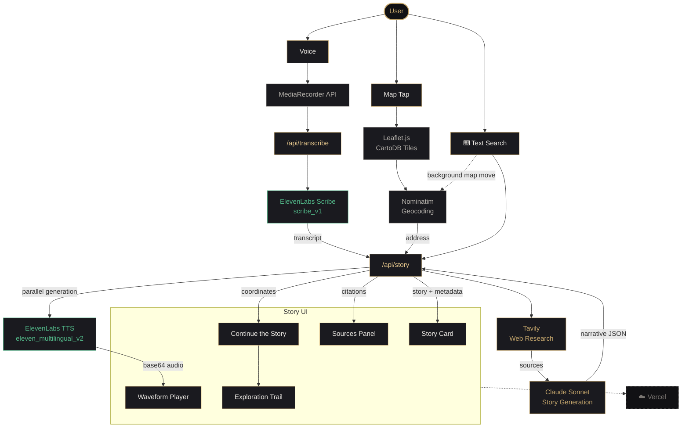

# Echoes

**Hack Brooklyn 2026 · Entertainment / Education**

> _Every place has a story. Now you can hear it._

---

## What is Echoes?

Echoes is a real-time, location-based audio storytelling platform for New York City. Tap any spot on the map, a street corner, a building, a park, and within seconds you hear a first-person narrative from a fictional voice of someone who actually lived there, grounded in real historical sources pulled live from the web.

No static pages. No Wikipedia summaries. A voice. A story. A moment in time.

Built in 48 hours at Hack Brooklyn 2026.

---

## Features

- Interactive map of all five NYC boroughs with 40+ curated historical hotspots
- Tap anywhere on the map to generate a unique, real-time story
- Text search and voice search for any NYC address or landmark
- AI narrator voice automatically matched to the era, background, and character of the story
- Documentary-style audio intro followed by a personal first-person narrative
- Echo trail, a dotted path on the map tracing everywhere you've listened this session
- Continue the story, suggests nearby locations connected by era and distance after each story ends
- Real source citations from Tavily shown under every story
- 8 narrator voice types matched dynamically to the generated persona
- Multilingual support across 8 languages, story rewritten and re-narrated in full

---

## How It Works

**1. Location input**
User taps the map, searches by text, or speaks a location via voice search. Voice is transcribed by ElevenLabs Scribe and fed into the same pipeline.

**2. Geocoding**
Nominatim reverse-geocodes coordinates into a real street address.

**3. Live research**
Tavily searches public archives, newspaper databases, historical records, and landmarks documentation for that specific location in real time.

**4. Narrative generation**
Claude reads the sources and generates a first-person story, choosing an era, a narrator persona, a title, an intro, and a factual context summary. The prompt is engineered to produce conversational, fragmented human speech rather than encyclopedic prose.

**5. Voice synthesis**
ElevenLabs generates two audio clips in parallel: a documentary-style intro narrated by a neutral voice, and the personal story narrated by a voice matched to the character's age, background, and era. SSML break tags are injected at natural pause points for authentic delivery.

**6. Delivery**
The story panel slides up with the quote, animated waveform, context text, and a sources panel showing exactly what Tavily found.

---

## Architecture

---

## Tech Stack

| Layer           | Technology                               |
| --------------- | ---------------------------------------- |
| Frontend        | Next.js 15 App Router                    |
| Map             | Leaflet.js + CartoDB Dark Matter tiles   |
| Research        | Tavily API                               |
| Narrative       | Claude API (claude-sonnet-4-6)           |
| Voice synthesis | ElevenLabs TTS (eleven_multilingual_v2)  |
| Speech to text  | ElevenLabs Scribe                        |
| Geocoding       | Nominatim (OpenStreetMap)                |
| Deployment      | Vercel (serverless, zero infrastructure) |

No database. No backend server. Fully stateless edge functions with base64 audio returned inline. Session state managed entirely in React.

---

## Important Note

All voices in Echoes are AI-generated by ElevenLabs and do not represent real individuals. The narrators are fictional composite characters grounded in verified historical facts from public sources. Echoes makes no claim to reproduce the actual voice or words of any real person.

---

## What We Learned

Getting AI to sound human is harder than getting it to sound correct. The breakthrough was rewriting the Claude prompt to generate fragmented, conversational speech, short sentences, trailing thoughts, natural hesitations, rather than grammatically complete prose. Combined with SSML break tags for natural pauses, the difference in voice delivery was dramatic.

History is everywhere. Testing Echoes on dozens of NYC locations while building it, we kept getting surprised. The stories Tavily surfaced, displaced communities, wartime factories, civil rights moments, forgotten neighborhoods — were more interesting than anything we could have invented.

---

## Future

- User-contributed stories and corrections
- Shareable story links
- Offline mode with pre-cached neighborhood stories
- AR overlay for mobile, point your camera at a building and hear its story

---

## Team

| Name           |                                                             |
| -------------- | ----------------------------------------------------------- |
| Husnain Khaliq | [LinkedIn](https://www.linkedin.com/in/husnain-kh)          |
| Tahreem Imran  | [LinkedIn](https://www.linkedin.com/in/tahreemimran04)      |
| Donald Reith   | [LinkedIn](https://www.linkedin.com/in/donaldbreith)        |
| Sanjida Akter  | [LinkedIn](https://www.linkedin.com/in/sanjida-a-24a550298) |

---

_Hack Brooklyn 2026 · Built in 48 hours_
